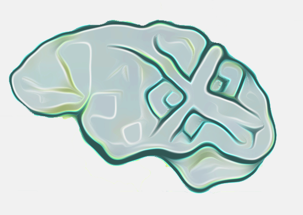

<p align="center">
  <a href="#key-features">Key Features</a> &nbsp; | &nbsp;
  <a href="#branches">Branches</a> &nbsp; | &nbsp;
  <a href="#getting-started">Getting Started</a> 
</p>
<h2 align="center">
  
  </br>AI-Sensory-Health
  </br>
</h2>

AI-Sensory-Health is a Mental Health App that uses Topic Modeling Technology (NMF) to connect users with sensory health

## Key Features 
- Tech Stack  `Java`  `Springboot`  `Angular` `PostgreSQL` 
- Tracking `Jira`
- Docs `Confluence` `Notion`
- Microservice Tools  
  - Load Balancer `Ribbon`  
  - API Gateway `ZuuL` 
  - Circuit Breaker  `Hystrix`  
  - Service Discovery `Consul` `Eureka`
  - Messaging Queue `RabbitMQ` 
  - Orchestration `Kubernetes` `Docker`
  - Config Management `Archaius`
  - Distributed Tracing & Logging  `Splunk`

## Branches
- **DIT**		  : Development branch
- **UAT**  	  : Testing branch 
- **PROD** 	  : Currently running in production
- **Release** : Code for specified release

## Getting Started
1. Clone development branch :
    ```bash
    # Clone repository
    $ git -b DIT clone https://github.com/yonderwire/AIHealth.git
    # Verify AIHealth is cloned
    $ ls 
    ...
    AIHealth
    ```
2. Import AIHealth into IDE (Ex. STS)
3. After making code changes, push to development branch
    ```bash
    $ git add .
    $ git commit -m "description of change" 
    $ git push origin DIT
    ```
4. In GitHub submit a pull request to merge to to testing (UAT) branch.
